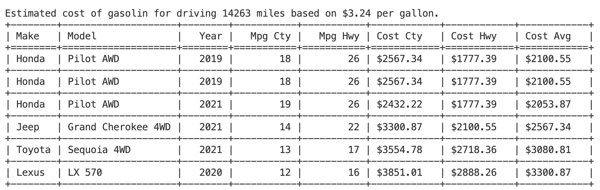

# *Project*
#### Video Demo: https://youtu.be/Q2pTxK56Tdg
#### Description: Python program to calculate the cost of gasoline and compare between multiple car models

___
\
For the final project for CS50P I wanted to push my own limits, to push beyond what was 
taught in the lectures.
\
\
The project is a program that calculates the cost of gasoline for a specified distance and compares 
this cost between multiple cars. The output is shown on screen and the data is saved as a csv file.
\
\
**Files included**:\
project.py: 
* Main file. 
* Accepts as optional input
  - distance (miles:) 
  - gas price (price:)
  - car mileages (mpg:)
* Example: 
  - python project.py miles:100 price:4 mpg:18/22   

car_class.py:    
* Separate file with the code for the CAR class 

call_ws.py:      
* Separate file with the code for the web service logic and calls

test_project.py: 
* Pytest file with test cases

\
**Description of the logic**:\
The arguments must be accompanied with an identifier (miles, price, mpg). 
The arguments can be omitted and can be given in any order.\
If "miles" is omitted, the user will be prompted for the distance to be used.\
If the gas price is omitted, the price will be checked with a web service call to 
[www.fueleconomy.gov/ws/](https://www.fueleconomy.gov/ws/).\
If the "mpg" is given, the program will not look up any cars and the calculations 
will be done based on this mpg. \
If no "mpg" is given, the user can enter multiple cars.
\
\
When the program starts, the arguments are checked and returned as a dictionary with
name for the argument and the corresponding value.
\
\
The user will be prompted to enter one or more cars (name, model, year). Each entry is 
verified against www.fueleconomy.gov and the mileage of each car is retrieved and added 
to the car object. The model field can be left blank for the program to show available 
models for that make and year. The list of models will also be shown if the model name 
is not valid. 
\
\
The cost of gas is then calculated for the distance for each car using the mileage and gas 
price entered as argument or retrieved via the web service call. The cost is calculated for 
mileage driving in city, highway and an average between the city and highway. The numbers are
presented via "tabulate" and the raw data exported to a csv file.
\
\
**Use cases**:\
Use case 1.\
You are about to travel by car for a longer distance (200 miles) and want to know 
how much thi will cost you in gas. If you know your car's mileage, let's say 18 mpg in city 
and 22 mpg on the highway, you can run the program like this:

            > python project.py miles:200 mpg:18/22

The program will look up current price of gasolin and calculate the cost for driving 200 miles 
in a car driving 18 mpg in city and 22 mpg on the highway:

            Gas price: $3.53 per gallon

            The cost in gas for driving 200 miles will in average be: 
                - driving in city    (18 mpg): $39.22
                - driving on highway (22 mpg): $32.09
                - mixed driving              : $35.30

In this case the cost of gas for mixed driving is estimated to be approximately $35
\
\
Use case 2:\
You are about to buy a new car and you are going to decide between 4 different
cars. One of the criterias is the expected cost of gas. The mpg figures are great for comparing 
which car has the best mileage, but what does that actually mean for your expected driving per 
year?\
Does it make sense for you to pay $4000 more for one model with a slightly better mpg 
score? Let's find out by comparing the estimated cost of gas between the cars.\
Let's say you expect to drive around 14.263 miles per year .... that is the average 
miles driven in the U.S.A. in 2022 according to the Federal Highway Commission (source 
[www.thezebra.com](https://www.thezebra.com/resources/driving/average-miles-driven-per-year/)) \
The program can then be started like this:

            > python project.py miles:14263

No price or mpg figures are given as arguments. The program will then lookup the current 
price of gas and let you enter the different cars you want to compare. The output could look 
like this:

The data shown as output is also saved in a csvfile (cars.csv) to use for example in a 
spreadsheet program.
\
\
**Reflections**:\
The idea of having the arguments to the program come with an identifier I got from working with Swift. 
I really liked the way the arguments are named when calling a function and that the arguments 
do not need to be in a specific order. I implemented this by having a function read and 
evaluate the arguments. If any, the first part of the argument is the identifier. The
identifier is checked against accepted identifiers (miles, price, mpg) and the corresponding
value is validated. The identifier and value must be separated by a colon (':').
The identifier and value is then added to a dictionary that is returned to main(). \
If a parameter is not given, a value can be looked up or the user can be prompted to give 
input. \
A missing gas price will tricker a lookup of current gas price. \
A missing distance will tricker a prompt for user input.\
The values found this way will be added to the dictionary of arguments as if the user
had given them in the first place.
\
\
My first design for the CAR class included user prompts for car details. I then thought this was
not the best design, it would limit how the CAR class could be used. In this specific case 
(for this project) it would not matter much from where the user input comes from. But I wanted
the program to avoid or at least limit side effects for the functions. \
I changed the design to prompt for the user input in a loop in main() and send the data along 
with each request to add an instance of the CAR class. \
However, that clogged up the main() with of lot of detailed code that ended up obscuring the flow
of the program. Back to the drawing board! Weighing pros and cons of having the user input in the 
class or in main() I decided to keep it in the class. I did however add an option in the design of 
the class to pass in the values so the class can now be instanciated either without or with the 
values needed to create the class instance. That cleaned up the main() and made the class more
flexible to use. \
An example of using the class by passing arguments is if the car details are read in from a file.
That feature is however not part of this project.
\
\
Half way through this project I realized that the website fueleconomi.gov that I use to do 
the lookup, also has a user interface that offers similar comparisons as I do in this 
program. This did not influence in any way how I designed my program. I did not get any of
the code and logic behind the web site user interface.
\
\
**Observation**:\
While working with the web service call to retrieve car details from fueleconomi.gov I
hit a brick wall! My web service call did not work as I would expect, it did not return the
car details that I requested. \
For testing I had checked the car database and found a model
"Pilot 4WD" for Honda. After several failed attempts to correct my code I finally tried with 
another model and to my surprise it worked. Using the model "Fit" gave me the car details I was 
looking for. In other context I have seen "4WD" being called "AWD" and when I tried that I got 
the data I was looking for. \
There was clearly a mismatch between different parts of the car 
database. The list of valid models did not match with the list of car details! But I learned 
an important leason about not having the values for same data entities spread over different 
tables or locations. Over time that will create these mis-matches. 
\
\
**Testing**:\
Since the function get_miles() takes user input I had to figure out how to simulate user input. 
It turned out to be fairly easy with "monkeypatch" that overrides the built-in input() function.\
\
When validating the arguments to the program, some invalid values will cause the program to exit.
I did not want the code to exit with the cryptic error messages that comes with ValueError etc. 
That I did know how to test for, but I wanted a cleaner output to the user and still be able to test 
it.\
I learned that using pytest "with pytest.raises(SystemExit) as ...." you can dive into the details of 
the exit. \
Example to test for "exit(9)":
            
            with pytest.raises(SystemExit) as sample:
                my_function(...)
            assert sample.type == SystemExit
            assert sample.value.code == 9

**Conclusion**:\
This was a great journey. Although CS50P is a lot easier than CS50x, it gave me a better and more 
detailed understanding of Python. And solving the problem sets gave me more confidence in writing 
Python code. This final project lead me even deeper into Python. \
Great thanks to the CS50 team!
